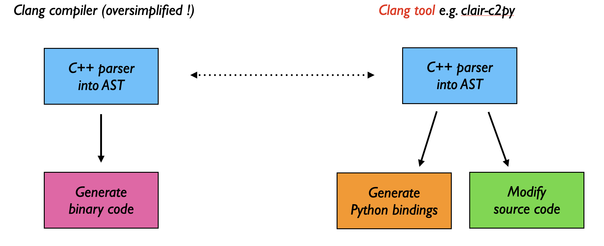
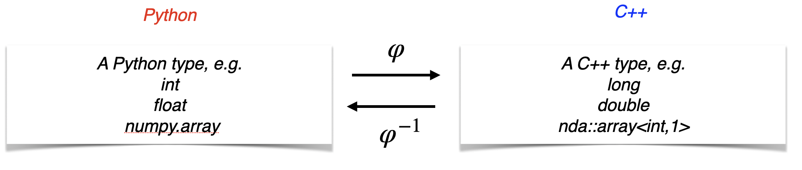

.. _basic_notions:

Basic notions
*************

What is a Clang tool ?
----------------------

``clair-c2py`` is a *Clang tool*: it parses C++ source files using the Clang compiler 
and generates Python bindings from the Abstract Syntax Tree (AST).

| LLVM/Clang is a modular library used to build both the Clang compiler and tools like ``clang-tidy``, ``clang-format``, etc.
| A Clang tool uses the same C++ parser as the compiler to build an AST,
| but instead of generating binary code, it analyzes or transforms the source code.

As a result, ``clair-c2py`` can handle the full C++ language, including the latest standards (C++20, C++23),
and is robust with complex code bases, macros, and templates.    

   A Clang tool reuses the compiler's parser to analyze or transform C++ code.

Type conversion
---------------

Principle
.........

Python and C++ types are different. 
For example, a ``long`` in C++ is converted from/to a Python integer.
In order to call a C++ function from Python, it is necessary to:

    * convert its arguments to C++,
    * call it and
    * convert its return value to Python.

This process is called *wrapping the function to Python*.
Only functions whose arguments and return value are of **convertible types** can be wrapped and therefore 
called across languages.

So calling a C++ function from Python involves converting types back and forth between Python and C++, 

.. math::

   f_{Py}(x_1, \dots, x_n) = \varphi^{-1} \left( f_{C++}\bigl( \varphi(x_1), \dots, \varphi(x_n)\bigr) \right)

.. note::

   ``clair`` issues a compilation error for any attempt to wrap a function with an inconvertible type.

Convertible types
..................

Convertible types include:

* Built-in types: ``int``, ``long``, ``float``, ``double``, ``bool``, etc.
* Standard library types: ``std::string``, ``std::vector<T>``, ``std::tuple<Ts...>``, ``std::optional<T>``, ``std::map<K,V>``, etc. 
  For a complete list, see :ref:`converters`.
* Wrapped types
* Third party library types, if the library provides converters, e.g. the `nda library <https://github.com/TRIQS/nda>`_. 
  To configure a third party library to automatically work with clair, 
  :ref:`see here <third_party_lib>`.

Dynamical dispatch
------------------

* In C++, objects are statically typed (one variable has one type fixed at compilation), and functions can be overloaded. 
* In Python, objects are dynamically typed, and there is no overload.

| As a result, several functions in C++ will typically be gathered into one Python function.
| When the Python function is called:

#. The number and types of its arguments are analyzed (at runtime), 
#. The first C++ function for which the Python arguments can be converted to the C++ arguments is called.
#. If none applies, a Python exception is raised.

This process is called **dynamical dispatch**. 
Let us illustrate it with a simple example.

.. literalinclude:: ../examples/fun1.cpp
   :language: cpp
   :caption: fun1.cpp
   :end-before: #include "fun1.wrap.cxx"

clair-c2py reports:

.. code-block:: console

    -- Function: f
    --         . f(int x)
    --         . f(int x, int y)
    --         . f(const std::string& s)

meaning that the 3 C++ overloads of ``f`` are "gathered" in one Python function ``f``.

.. testsetup::

   import sys
   import os
   # Add the examples build directory to Python path
   # Doctest runs from build/doc, examples are in build/doc/examples
   sys.path.insert(0, os.path.abspath('examples'))

.. doctest::

   >>> import fun1 as M
   >>> M.f(1)
   -1
   >>> M.f(1,2)
   3
   >>> M.f("abc")
   'abcabc'

If no dispatch is possible for the arguments given, ``c2py`` reports a ``TypeError``, e.g.

.. doctest::

    >>> M.f(1,2,3)
    Traceback (most recent call last):
      ...
    TypeError: [c2py] Can not call the function with the arguments
       (1, 2, 3)
    The dispatch to C++ failed with the following error(s):
    [1] (x: int)
        -> int
        -- Too many arguments. Expected at most 1 and got 3
    <BLANKLINE>
    [2] (x: int, y: int)
        -> int
        -- Too many arguments. Expected at most 2 and got 3
    <BLANKLINE>
    [3] (s: str)
        -> str
        -- Too many arguments. Expected at most 1 and got 3
    <BLANKLINE>
    <BLANKLINE>

or 

.. doctest::

    >>> M.f([1,2,3])
    Traceback (most recent call last):
      ...
    TypeError: [c2py] Can not call the function with the arguments
       ([1, 2, 3],)
    The dispatch to C++ failed with the following error(s):
    [1] (x: int)
        -> int
        -- x: Cannot convert [1, 2, 3] to integer type
    <BLANKLINE>
    [2] (x: int, y: int)
        -> int
        -- Too few arguments. Expected at least 2 and got 1
    <BLANKLINE>
    [3] (s: str)
        -> str
        -- s: Cannot convert [1, 2, 3] to string
    <BLANKLINE>
    <BLANKLINE>

